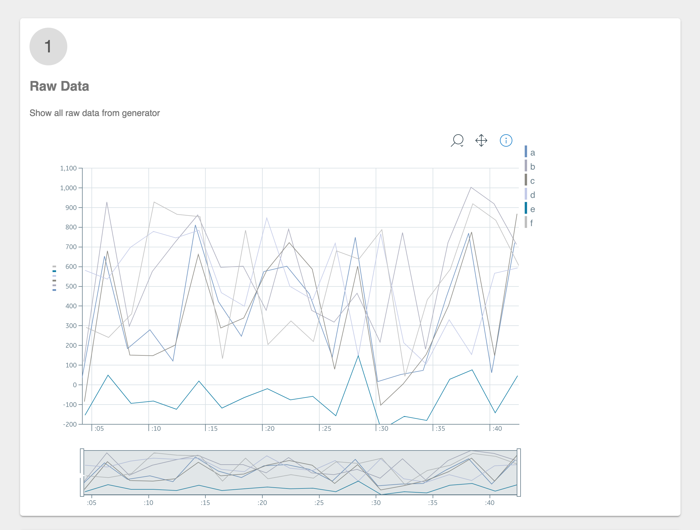
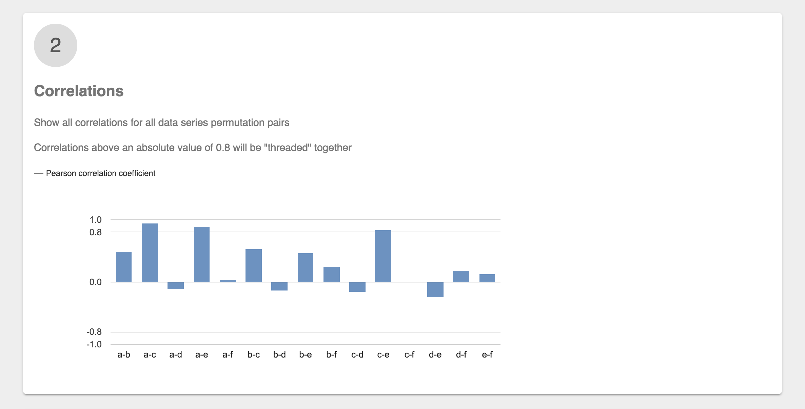
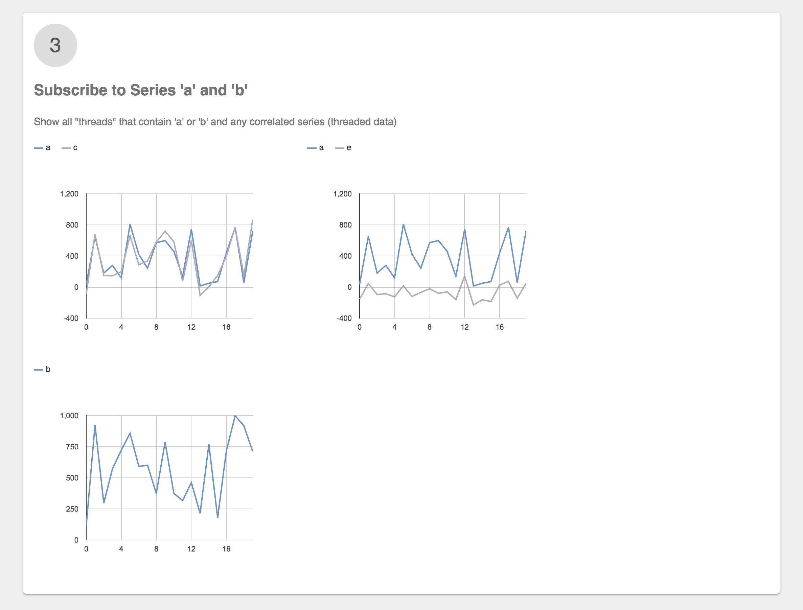
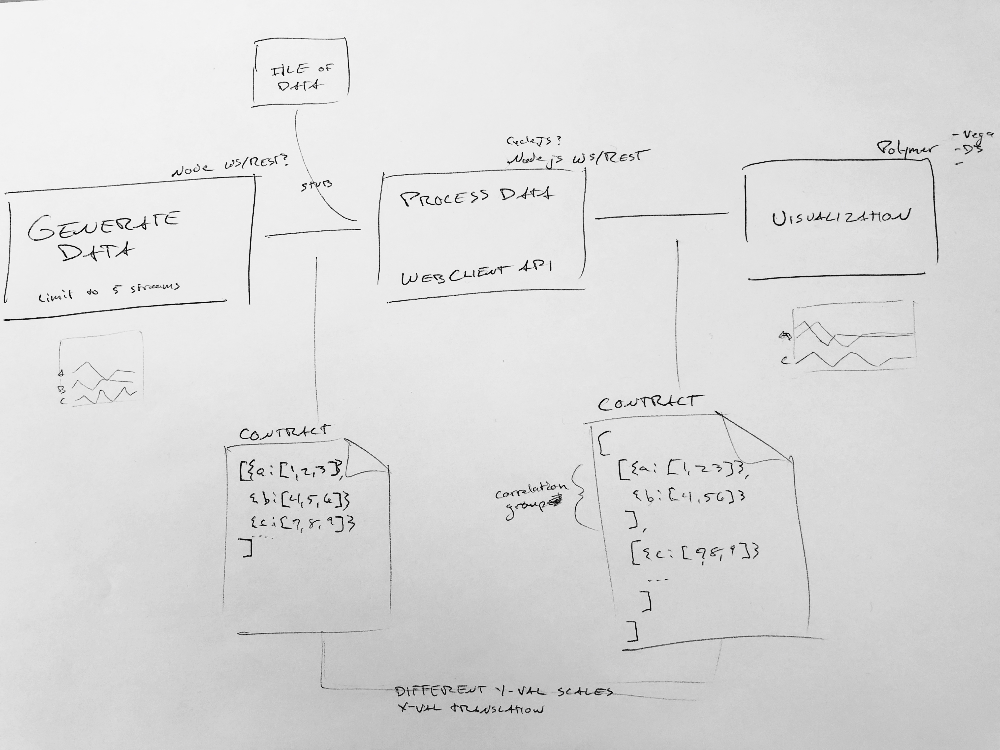

# stream-correlation

Detect stream correlations in a limited number of streams

Thread correlated streams together and display in UI

--- 

## What and Why

### Scenario: What Data is Correlated?

- **Given** a continuous stream of data for multiple series
- **When** I focus on one stream
- **Then** I want to see which streams are correlated

While the data processing for determining correlated streams is a simple use of a correlation library, performing the full implementation of this solution for streaming data raises many important questions. *These technology agnostic implementation considerations comprise the most meaningful and lasting benefit from this exercise.*

#### Implementation Questions

1. How much data should be analyzed to determine correlation? (Min and max data set sizes?)
1. How does the data structure translate from initial series to multiple threaded series?
1. How do you handle two series that are intermittently correlated?

---

## Dev

### Folder Structure

1. [Generate](./1-generate) data from a data source
1. [Process](./2-process) data from the source
1. [Visualize](./3-visualize) the processed data

### Install & Run

1. `npm run install` Runs install scripts for all three sub-directories, each in a separate terminal
1. `npm run start` Runs start scripts for each sub-directory, each in a separate terminal
1. Use Chrome to navigate to `http://127.0.0.1:8000/components/3-visualize/`

### Preview

### Basic Process Sketch

